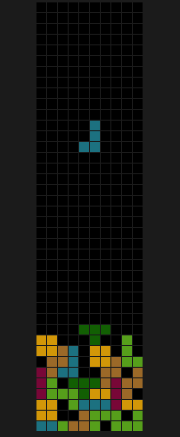

<div align="center">

  <h1><code>wasm-tetris</code></h1>

  <strong>A simple tetris clone built using <a href="https://github.com/rustwasm/wasm-pack">wasm-pack</a>.</strong>
</div>

# Tetris

## Preview

<p align="center"></p>

## Usage

In order to run this demo you will need Rust and `wasm-pack` along side npm (check the section below).

To build the demo and run it in your browser:

```
$ wasm-pack build
$ cd www
$ npm install
$ npm run start
```

Controls are W A S D

# The Template Used

## About

[**📚 Read this template tutorial! 📚**][template-docs]

This template is designed for compiling Rust libraries into WebAssembly and
publishing the resulting package to NPM.

Be sure to check out [other `wasm-pack` tutorials online][tutorials] for other
templates and usages of `wasm-pack`.

[tutorials]: https://rustwasm.github.io/docs/wasm-pack/tutorials/index.html
[template-docs]: https://rustwasm.github.io/docs/wasm-pack/tutorials/npm-browser-packages/index.html

## 🚴 Usage

### 🐑 Use `cargo generate` to Clone this Template

[Learn more about `cargo generate` here.](https://github.com/ashleygwilliams/cargo-generate)

```
cargo generate --git https://github.com/rustwasm/wasm-pack-template.git --name my-project
cd my-project
```

### 🛠️ Build with `wasm-pack build`

```
wasm-pack build
```

### 🔬 Test in Headless Browsers with `wasm-pack test`

```
wasm-pack test --headless --firefox
```

### 🎁 Publish to NPM with `wasm-pack publish`

```
wasm-pack publish
```

## 🔋 Batteries Included

* [`wasm-bindgen`](https://github.com/rustwasm/wasm-bindgen) for communicating
  between WebAssembly and JavaScript.
* [`console_error_panic_hook`](https://github.com/rustwasm/console_error_panic_hook)
  for logging panic messages to the developer console.
* [`wee_alloc`](https://github.com/rustwasm/wee_alloc), an allocator optimized
  for small code size.
